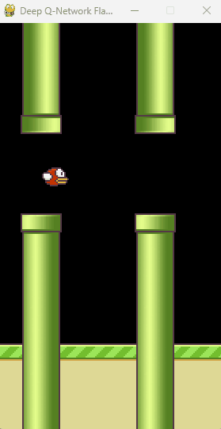

# Navigasi Otomatis Flappy Bird Berbasis Piksel Menggunakan Deep Q-Network (DQN)

<p align="center">
  
</p>

Proyek ini merupakan implementasi **Deep Reinforcement Learning (DRL)** untuk melatih agen agar dapat menavigasi rintangan pada simulasi game Flappy Bird secara mandiri. 

Pendekatan utama dalam proyek ini difokuskan pada ekstraksi fitur visual; agen tidak diberikan input numerik yang disederhanakan (seperti jarak koordinat burung ke pipa), melainkan harus mengobservasi lingkungan murni dari matriks piksel mentah di layar menggunakan **Convolutional Neural Network (CNN)** yang dipadukan dengan algoritma **Q-Learning**.

## 🧠 Arsitektur & Metode Algoritma
* **Environment:** PyGame (Simulasi Flappy Bird)
* **Paradigma AI:** Reinforcement Learning (Sistem Reward & Penalty)
* **Arsitektur Ekstraksi Fitur:** Convolutional Neural Network (CNN) - Mengonversi piksel layar menjadi pemahaman ruang.
* **Algoritma Pengambil Keputusan:** Deep Q-Network (DQN) - Menghitung probabilitas tindakan (*Q-Value*) terbaik berdasarkan observasi CNN.

## 📂 Struktur Repositori
Struktur direktori disusun untuk memisahkan antara proses komputasi pelatihan, pengujian otomatis, dan hasil akhir evaluasi:

```text
Flappy-Bird-AI/
├── assets/                     # Aset visual
├── 01.Latihan_Burung.ipynb     # Skrip utama pelatihan model DQN dari nol
├── 02.Pencari_Burung.ipynb     # Skrip otomasi evaluasi massal (Headless Mode)
├── 03.Uji_Burung.ipynb         # Skrip pengujian visual untuk 1 model spesifik
├── laporan_performa.csv        # Tabel riwayat performa model (Learning Curve)
├── Dependencies.md             # Catatan lingkungan instalasi
└── README.md                   

Nama  = Evandes Nathanael G
NIM   = 221344007
Kelas = 4A-TNK
TEKNIK TELEKOMUNIKASI NIRKABEL | POLITEKNIK NEGERI BANDUNG

⚙️ Kebutuhan Sistem (Dependencies)
Proyek ini berjalan optimal dengan akselerasi GPU (CUDA). Berikut adalah pustaka utama yang dibutuhkan:

torch (PyTorch dengan CUDA 12.1 sesuai sweet spot GPU (RTX 3050 Laptop))

torchvision

pygame

numpy